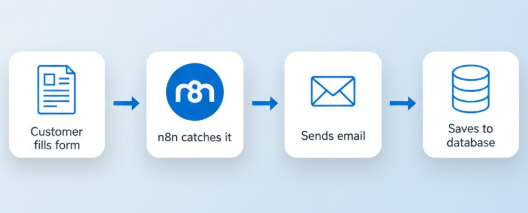

# AutoBiz

## Project Overview
AutoBiz is a business automation system that automates repetitive tasks like collecting customer details, sending emails, storing data, and tracking progress. It is designed for small businesses to save time and reduce errors.

## Features
### Implemented
- Initial n8n workflow setup
- First automation workflow executed
- Business workflow diagram created

### Planned
- More complex workflows for email, task assignment, and notifications
- Integration with databases and cloud

## Tech Stack
- **n8n:** Automation engine for workflows
- **PostgreSQL:** Stores customer and lead data
- **Email/Webhooks:** Automated communication
- **Local machine:** Development environment (cloud hosting later)

## System Overview
A workflow triggers actions automatically:
Customer fills form → Data stored → Email sent → Team notified.

## Project Status
- **Current week:** Week 1
- **Completed:** n8n installation, first workflow, workflow diagram
- **In progress:** Understanding automation triggers and data flow
